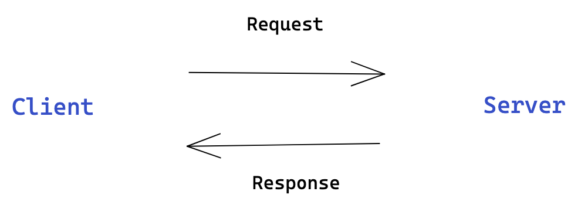

# Swagger and Open API <!-- omit in toc -->

Pada modul ini, kita akan belajar mengenai dokumentasi yaitu dokumentasi API. Kita akan bahas bagaimana cara menggunakan Swagger dan OpenAPI Specification.

Outline: 
- [Definisi API](#definisi-api)
  - [Cara kerja API](#cara-kerja-api)
- [OpenAPI Specification](#openapi-specification)
  - [Dokumen OpenAPI](#dokumen-openapi)
  - [API Endpoints](#api-endpoints)
    - [Path Item Object](#path-item-object)
    - [Response Object](#response-object)
- [Documentation](#documentation)
  - [Swagger](#swagger)
- [Swagger UI Exercise](#swagger-ui-exercise)
- [Summary](#summary)

## Definisi API

API (Application Programming Interface) merupakan sekumpulan aturan dan protokol yang memungkinkan untuk pertukaran data antar aplikasi. API juga memungkinkan komunikasi antar aplikasi yang berbeda. Ada beberapa jenis tipe API, pada modul ini kita akan hanya bahas Web API.

### Cara kerja API

Lalu bagaimana sebuah API bekerja?

Pada saat mengakses sebuah website atau aplikasi di smartphone, katakanlah instagram. Untuk mendapatkan data feed instagram maka akan dibutuhkan sebuah API Request ke server instagram kemudian server instagram akan merespon dengan data yang akan ditampilkan di feed instagram.



Swagger dan OpenAPI Specification dirancang untuk digunakan pada REST API. REST API termasuk ke tipe Web API.

## OpenAPI Specification

OpenAPI Specification (OAS) adalah format standar yang mendefinisikan stuktur dan sintaks REST API yang memungkinkan manusia dan komputer untuk memahami API dan cara kerjanya tanpa memerlukan akses ke source code atau dokumentasi tambahan. 

OAS file mendeksripsikan tentang API, seperti:

- Endpoints yang tersedia (/users) dan operasi di setiap endpoint (GET /users, POST /users)
- Parameters operasi input dan output untuk setiap operasi 
- Metode authentikasi (Oauth, API Key, dll)
- Informasi kontak, lisensi, dan terms yang digunakan dan informasi lainnya.

### Dokumen OpenAPI

Dokumen OpenAPI atau OpenAPI Document merupakan file yang mendeskripsikan semua hal tentang API dan apa yang bisa dilakukan oleh API. Dokumen OpenAPI memiliki format JSON atau YAML.

Setiap dokumen OpenAPI harus berisi sebuah root object dengan memiliki fields openapi dan info dan setidaknya selain itu berisi fields paths, components, dab webhooks.

Contoh dokumen OpenAPI:

```
openapi: 3.1.0
info:
  title: A minimal OpenAPI document
  version: 0.0.1
paths: {} # No endpoints defined
```

Contoh diatas merupakan minimal dokumen OpenAPI yang belum berisi endpoints.

### API Endpoints

API Endpoints (juga disebut sebagai Operations or Routes) di OAS disebut sebagai Paths. Paths object dapat diakses melalui ``paths``. Paths harus dimulai dengan "slash (/)".

Contohnya:

```
openapi: 3.1.0
info:
  title: Music API
  description: |
    This API allows add playlist, music and get playlist list.
  version: 1.0.0
paths:
  /user:
    ...
```

#### Path Item Object

Path Item Object mendeskripsikan HTTP operations (get, put, delete) dan juga properti umum untuk seluruh operations on path seperti summary dan description. Detail dari setiap operation dapat dilihat di child operation object.

```
paths:
  /user:
    get:
      ...
    put:
      ...
```

#### Response Object

Objek respons (response object) merupakan respons dari server yang akan diberikan ke request yang dilakukan client. 

Objek respons harus berisi setidaknya satu kode respons (response code), dan jika hanya satu kode respons yang diberikan, itu harus respons untuk request yang berhasil (biasanya HTTP response code 200). Response code diapit dengan tanda kutip (misalnya "200"). Rentang response code yang diizinkan yaitu: 1XX, 2XX, 3XX, 4XX and 5XX.

Contoh: 

```
paths:
  /user:
    get:
      summary: Get the all users
      description: Retrieves list of all users.
      parameters:
        ...
      responses:
        "200":
        ...
```

## Documentation

Dokumentasi merupakan bagian kritikal dari OAS file, dalam membuat dokumentasi dapat menggunakan tool autogenerated documentation (termasuk juga swagger) yang mana akan generate OAS file ke HTML documentation yang bisa diakses melalui web.

### Swagger

Swagger adalah tools yang banyak digunakan untuk mengembangkan API dengan OpenAPI Specification (OAS). Swagger mendiskripsikan struktur API sehingga mesin bisa membacanya. Dan yang paling menarik dari swagger adalah kemampuan API untuk deskripsikan strukturnya sendiri.

Dokumentasi API dengan swagger bisa dengan cara manual atau generate otomasi dari anotasi yang ada di source code.  Karena OAS file sering update maka lebih baik menulis dengan cara manual. Untuk bacaan lebih lanjut bisa di cek di swagger.io/open-source-integrations.

## Swagger UI Exercise

Setelah mengetahui basic OpenAPI Specifications, maka selanjutnya adalah melakukan latihan untuk membuat API Dokumentasi.

Bukalah project nest yang sudah dibuat pada modul clean architecture. Kemudian install swagger dengan perintah berikut:

```
npm install --save @nestjs/swagger
```

Setelah proses instalasi selesai, buka file ``main.ts`` dan inisialisasi swagger dengan swagger module:

```
async function bootstrap() {
  const app = await NestFactory.create(AppModule);
  app.setGlobalPrefix('api/v1');

  const config = new DocumentBuilder()
    .setTitle('User example')
    .setDescription('The users API description')
    .setVersion('1.0')
    .build();

  const document = SwaggerModule.createDocument(app, config);
  SwaggerModule.setup('api', app, document);

  await app.listen(3000);
}
bootstrap();
```

DocumentBuilder membantu dalam menyusun stuktur dokumen dasar yang sesuai dengan OAS. Dan berisi pengaturan properti seperti title, description, version, dll.

Kemudian jalankan aplikasi menggunakan perintah ``npm run start``. Setelah itu bukalah browser dan akses url http://localhost:3000/api maka akan tampil halaman swagger ui.


Swagger module secara otomatis akan generate seluruh endpoints yang ada menjadi OAS file dalam format HTML.

Untuk melakukan uji coba, klik ``try it out`` dan ``execute`` dan akan mengembalikan tampilan berikut ini:


## Summary

- Definisi API, API (Application Programming Interface) merupakan sekumpulan aturan dan protokol yang memungkinkan untuk pertukaran data antar aplikasi. API juga memungkinkan komunikasi antar aplikasi yang berbeda.
- OpenAPI Specifications (OAS), adalah format standar yang mendefinisikan stuktur dan sintaks REST API yang memungkinkan manusia dan komputer untuk memahami API dan cara kerjanya tanpa memerlukan akses ke source code atau dokumentasi tambahan. 
- Swagger adalah tools yang banyak digunakan untuk mengembangkan API dengan OpenAPI Specification (OAS). Swagger mendiskripsikan struktur API sehingga mesin bisa membacanya. Dan yang paling menarik dari swagger adalah kemampuan API untuk deskripsikan strukturnya sendiri.
