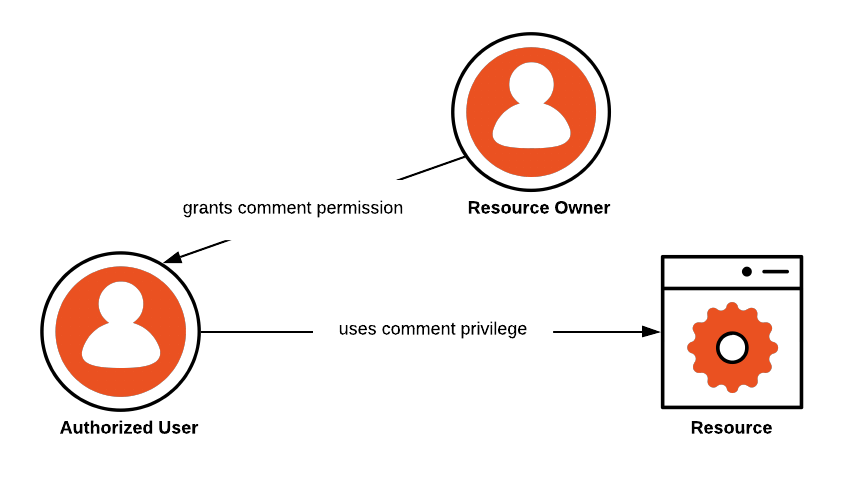

# Authentication and Authorization <!-- omit in toc -->

Pada modul ini, kita akan membahas tentang pentingnya mengamankan akses ke sistem atau aplikasi dengan menggunakan metode autentikasi dan otorisasi yang tepat. Dalam era digital saat ini, keamanan data sangatlah penting, terutama bagi perusahaan dan organisasi yang melakukan transaksi dan menyimpan data penting dan rahasia. Oleh karena itu, pemahaman yang baik tentang authentication and authorization sangat diperlukan. Mari kita mulai pembahasan modul ini dengan seksama!

Outline:
- [What is authentication](#what-is-authentication)
- [Common Authentication Types](#common-authentication-types)
- [What is authorization?](#what-is-authorization)
- [Summary](#summary)

## What is authentication

Otentikasi (authentication) merupakan proses verifikasi identitas pengguna yang umum dilakukan dalam sebuah aplikasi di teknologi informasi. Otentikasi secara umum dilakukan dengan meminta kredensial pengguna berupa nama dan kata sandi. Otentikasi bertujuan untuk melindungi akses dan data aplikasi. Misalnya, pada saat mengakses aplikasi biasanya diminta untuk memasukkan nama pengguna dan kata sandi. Kemudian, aplikasi akan membandingkan nama pengguna dan sandi yang dimasukkan dengan data yang ada di database. Jika informasi yang dikirimkan cocok, maka otentikasi valid dan akan memberikan akses ke aplikasi. Pengguna yang tidak melakukan otentikasi akan dianggap sebagai guest user dan tidak akan memiliki akses penuh atau bahkan tidak diberi akses sama sekali ke aplikasi. Pentingnya otentikasi dalam dunia teknologi informasi berkaitan dengan keamanan dan privasi data. Dengan adanya otentikasi, suatu sistem atau layanan dapat memastikan bahwa hanya orang yang sah yang memiliki akses ke data atau informasi yang sensitif.

## Common Authentication Types

Untuk melakukan otentikasi dapat dilakukan dengan berbagai cara, di antaranya adalah:

1. Password Authentication
   Otentikasi menggunakan kata sandi merupakan cara otentikasi paling umum. Pengguna harus memasukkan kata sandi atau PIN yang valid untuk mendapatkan akses ke sistem. Kata sandi bisa berbentuk huruf, angka, karakter khusus atau gabungan dari ketiganya.
   
2. Multi-factor Authentication (MFA)
   Otentikasi dua langkah adalah proses otentikasi yang mengharuskan pengguna untuk memasukkan 2 faktor seperti kata sandi dan kode yang dikirim ke email atau no telephone. Otentikasi dua langkah meningkatkan keamanan ketika kata sandi berhasil dibobol. Biasanya sistem yang menerapkan otentikasi dua langkah, ketika pengguna mencoba untuk login ke sistem menggunakan kata sandi, sistem akan mengirimkan kode sekali pakai ke email yang didaftarkan pengguna atau ke nomor telephone.

3. Token Authentication
   Otentikasi token adalah verifikasi identitas pengguna menggunakan token yang diberikan oleh sistem. Token memiliki masa aktif, selama token masih aktif maka ketika pengguna mengakses aplikasi atau sistem pengguna tidak perlu lagi memasukkan kredensial. Token akan digenerate secara otomatis oleh sistem oleh karena itu membutuhkan sedikit pengkodean.

4. Certificate Authentication
   Otentikasi sertifikat (certificate authentication) adalah proses otentikasi menggunakan sertifikat digital untuk verifikasi pengguna, device, atau machine. Sertifikat digital adalah dokumen elektronik yang berisi informasi identitas seseorang atau organisasi, seperti nama, alamat email, dan public key. Sertifikat digital dikeluarkan oleh Autoritas Sertifikat (Certification Authority/CA) yang terpercaya.
   Tidak seperti otentikasi lainnya, otentikasi berbasis sertifikat dapat diterapkan untuk server, komputer pribadi, e-paspor, mobile phone dan lain-lain.
   
5. Biometric Authentication
   Otentikasi biometrik adalah proses otentikasi yang menggunakan karakteristik fisik dari setiap pengguna untuk verifikasi. Beberapa contoh verifikasi menggunakan fisik untuk otentikasi biometric antara lain sidik jari, wajah, iris mata, dan suara. Sistem otentikasi biometrik membandingkan karakteristik fisik dengan data yang disimpan dalam database. Jika kedua sampel data biometrik cocok, maka otetikasi valid.Untuk menggunakan otentikasi biometric, pengguna harus memasukkan data biometriknya ke dalam sistem atau layanan.

## What is authorization?

Otorisasi (authorization) merupakan proses memberikan akses ke pengguna terhadap resources atau layanan sesuai dengan hak akses yang dimiliki pengguna. Otorisasi biasanya dilakukan berbarengan dengan otentikasi. Misalnya pengguna hanya bisa mengakses resources atau layanan yang hanya boleh diakses oleh pengguna, ketika pengguna dengan role yang berbeda seperti admin, admin tidak akan bisa mengkases resources atau layanan yang ditujukan untuk pengguna, begitupun sebaliknya.

Pada gambar diatas dapat dilihat bahwa hanya pengguna yang sudah diberikan hak akses yang dapat mengakses resources.

## Summary

Setelah kita melakukan pembahasan mengenai otentikasi dan otorisai, diharapkan mendapatkan pemahaman yang lebih baik tentang bagaimana mengamankan akses ke sistem dan data penting. Pastikan untuk selalu mengikuti praktik terbaik dalam otentikasi dan otorisasi untuk melindungi keamanan sistem dan informasi sensitif. Terima kasih telah mengikuti modul ini.