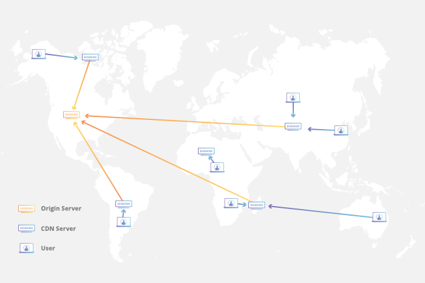

# Cache and CDN <!-- omit in toc -->

Cache dan CDN (Content Delivery Network) adalah dua konsep penting dalam pengelolaan dan pengiriman konten di aplikasi. Dalam pembahasan ini, kita akan membahas secara mendalam tentang apa itu cache dan CDN, bagaimana keduanya bekerja, serta perbedaan dan keuntungan masing-masing konsep. Mari kita mulai pembahasan modul ini dengan seksama!

Outline:
- [Cache definition](#cache-definition)
- [Web Cache technique](#web-cache-technique)
  - [Server-side caching type](#server-side-caching-type)
    - [CDN Cache](#cdn-cache)
    - [Benefit CDN](#benefit-cdn)
- [Summary](#summary)

## Cache definition

Cache adalah penyimpanan data berkecepatan tinggi yang menyimpan subset data dan bersifat sementara. Teknik caching membuat proses pengambilan data lebih cepat daripada mengambil data dari sumber penyimpanan utama seperti server atau database. Saat pertama kali permintaan data dilakukan, data akan disimpan dalam perangkat keras seperti RAM dan ketika permintaan data untuk kedua kalinya, permintaan itu tidak akan dilakukan ke sumber utama melainkan berasal dari Cache. Caching memungkinkan untuk menggunakan kembali data yang telah disimpan yang bukan berasal dari sumber utama dan membuat proses permintan data lebih cepat. 

Tujuan dari cache ini adalah untuk mengurangi beban server dan database ketika terjadi permintaan data, mempercepat response ketika terjadi permintaan, dan meningkatkan performa aplikasi.

## Web Cache technique

Caching web adalah caching yang dilakukan di server atau browser pengguna. Untuk penjelasan lebih detailnya dapat dilihat dibawah ini:

1. Client-side cache
   Merupakan teknik caching yang menyimpan data sementara di browser pengguna alih-aih disimpan di server. Ketika pengguna mengakses sebuah situs web, salinan halaman web akan disimpan di browser sehingga konten web akan dimuat lebih cepat. HTML, CSS, gambar dan multimedia file lainnya akan disimpan di browser pengguna sehingga tidak perlu lagi memanggil atau meminta data dari server. Cache di browser akan menggunakan memory device user.
   

2. Server-side cache
   Merupakan teknik caching yang menyimpan data sementara di memori server untuk digunakan kembali. Ketika pengguna mengakses website dan meminta data ke server untuk pertama kali, dilakukan seperti biasanya. Namun setelah permintaan direspon server, server akan menyalin respon tersebut yang terdiri dari halaman web dan data yang akan disimpan sebagai cache sehingga ketika pengguna mengakses website untuk yang ke dua kalinya permintaan tersebut akan direspon oleh cache sehingga akan meringankan beban server dan memuat data lebih cepat.
   Ada dua penyimpanan memori yang populer digunakan untuk server side cache, yaitu Redis dan Memcached.

   

   ### Server-side caching type

   Ada beberapa type server-side caching, diantaranya yaitu: Object caching, Opcode caching dan CDN caching. Namun dalam modul kali ini kita hanya akan bahas mengenai CDN caching.

   #### CDN Cache
   
   Content Delivery Network (CDN) merupakan penyimpanan konten berupa gambar, video dan halaman web di server proxy yang terletak lebih dekat dengan pengguna. Karena lebih dekat dengan pengguna daripada server asal maka konten akan lebih cepat diterima oleh pengguna. Saat pengguna mengakses website menggunakan CDN, CDN akan mengambil konten dari server asal dan menyimpan salinan konten tersebut untuk digunakan dimasa mendatang saat pengguna mengakses website tersebut.

   

   Ada banyak penyedia CDN yang populer diantaranya adalah Cloudflare, Amazon CloudFront, Microsoft Azure CDN dan lainnya. Salah satu penyedia CDN seperti Cloudflare memiliki server CDN di 285 kota yang tersebear di seluruh dunia sehingga pengguna akan semakin dekat dengan server CDN.

   #### Benefit CDN
   
   Web aplikasi yang menggunakan CDN memiliki benefit, yaitu:
   
   1. Performance
      Situs web yang menggunakan CDN dapat mengalami pengurangan waktu load sebesar 50%, atau bahkan lebih dalam beberapa kasus. CDN mempercepat pengiriman konten website.

   2. Realibility
      CDN terdiri dari beberapa server yang tersebar di banyak data center yang berbeda. Jika server, data center, atau seluruh wilayah data center mati, CDN masih dapat mengirimkan konten dari server lain di jaringan.

   3. Cost savings
      CDN mengurangi pengeluaran situs web dengan cara mengurangi permintaan dan respon dari dan ke server asal. Semakin banyak data yang ditransfer, semakin besar biayanya. Karena CDN meng-cache sebagian besar konten di situs web dan menyajikan konten tersebut dari cache, server asal tidak harus mengirimkan konten yang sama berulang kali sehingga ini akan mengurangi biaya.

   4. Resilience
      CDN lebih mampu menyeimbangkan lalu lintas jaringan dalam jumlah besar, bahkan lonjakan lalu lintas yang tidak wajar dari serangan DDoS karena CDN memiliki banyak server sehingga situs web tetap online bahkan saat diserang.

## Summary

Dalam modul ini, kita telah mempelajari tentang cache dan CDN, serta bagaimana keduanya dapat membantu meningkatkan kecepatan dan kinerja situs web. Cache memungkinkan untuk menyimpan data yang sering diminta di server lokal untuk mengurangi waktu akses ke sumber daya tersebut. Sedangkan CDN mempercepat pengiriman konten situs web dengan mendistribusikan salinan konten ke server di seluruh dunia. Dalam rangka untuk mencapai pengalaman pengguna yang optimal, penting untuk mempertimbangkan penggunaan cache dan CDN dalam desain dan pengembangan sebuah situs web. Terima kasih telah mengikuti modul ini dan semoga bermanfaat.

