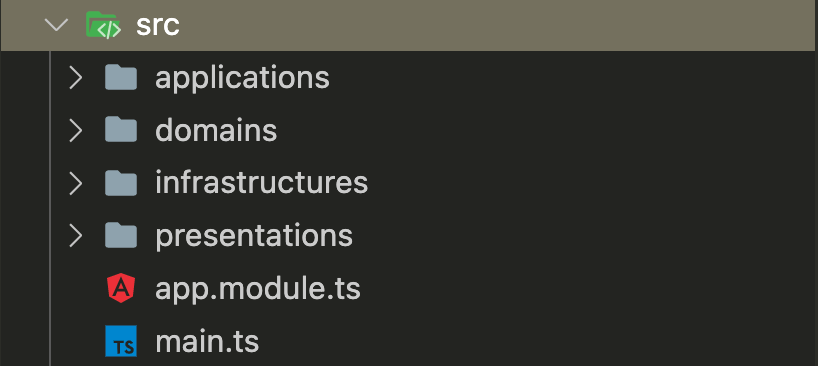

# Clean Architecture <!-- omit in toc -->

Dalam mengembangkan aplikasi terutama yang berskala besar, dibutuhkan penulisan kode dan desain arsitektur yang baik agar aplikasi sustainable (dapat bertahan) dan mudah dikembangkan kedepannya sesuai dengan berkembangnya perusahaan atau organisasi. Pada modul ini kita akan belajar mendesain arsitketur aplikasi dengan ``Clean Architecture``. Seorang developer profesional yang bisa mendesain aplikasi dengan baik menjadi nilai tambah, jadi simak materi ini dengan baik ya!

Outline:
- [What is Clean Architecture](#what-is-clean-architecture)
- [The Dependency Rule](#the-dependency-rule)
- [Benefit Clean Architecture](#benefit-clean-architecture)
- [Clean Architecture Example](#clean-architecture-example)
  - [Menyiapkan Project](#menyiapkan-project)
  - [Menyiapkan Configuration](#menyiapkan-configuration)
  - [Menyiapkan Configuration TypeORM](#menyiapkan-configuration-typeorm)
  - [Menyiapkan Database](#menyiapkan-database)
  - [Entity](#entity)
  - [Domains](#domains)
  - [Applications](#applications)
  - [Presentations](#presentations)
  - [Running App](#running-app)
- [Summary](#summary)

## What is Clean Architecture

Clean architecture merupakan software architecture yang menerapkan konsep clean code dan SOLID principle dalam membangun aplikasi yang scalable, testable, and maintainable.

Clean architecture dipopulerkan oleh Robert C. Martin, atau yang lebih dikenal sebagai “Uncle Bob” pada tahun 2008. 

Clean architecture berfokus pada memisahkan logika bisnis dengan framework atau aplikasi eksternal. Setiap komponen yang ada bersifat independen dan tidak bergantung pada library external yang spesifik.


Clean architecture dibagi menjadi 4 layer (lapisan), yaitu:

1. Entities (Enterprise Business Rules)
   
   Entities merupakan deskripsi dari aturan bisnis atau objek bisnis dari aplikasi. Di layer ini ditulis aturan bisnis aplikasi yang bersifat static dan tidak berubah. Entities tidak akan berubah ketika terjadi perubahan external. Entities dapat berupa objek dengan method, atau berupa kumpulan struktur dan fungsi data. 
   
2. Use Cases (Application Business Rules)
   
   Use case merupakan orkestrasi aliran data dari dan ke entities, dan mengarahkan entities untuk menggunakan aturan bisnis untuk mencapai objektif kebutuhan bisnis.
   
   Ketika use case mengalami perubahan, tidak akan berpengaruh ke entities. Begitu juga dengan perubahan yang terjadi di external seperti database dan UI tidak akan berpengaruh ke use case.

3. Interface adapters

   Layer ini merupakan kumpulan dari adapter yang menterjemahkan data ke format yang digunakan oleh use case dan entities dan juga menterjemahkan data ke format yang digunakan oleh external layer seperti framework.
   
4. Frameworks and drivers
   
   Layer terluar yang terdiri dari framework dan tools seperti database, web framework dan lainnya. Kode tidak banyak ditulis di layer ini kecuali untuk keperluan berkomunikasi ke layer berikutnya yang ada di dalam.

## The Dependency Rule

The dependency rule mengatakan bahwa dependensi kode hanya boleh mengarah ke dalam, maksudnya adalah layer yang didalam tidak dapat mengetahui apapun yang ada di layer luar dan tidak bergantung ke layer yang diluar. Sebaliknya layer yang diluar bergantung ke layer yang ada di dalam.

## Benefit Clean Architecture 

Clean architecture memiliki benefit yaitu:

- Independent of Framework : Tidak bergantung terhadap framework dan library karna framework dan library hanya sebagai tools.
- Testable : Bisnis rule bisa ditesting dengan mudah karena tidak bergantung terhadap Interface, Database, atau elemen external.
- Independent of UI : User interface dapat diubah dengan mudah tanpa merubah seluruh sistem. 
- Independent of Database : Database dapat diubah dari misalnya Oracle ke MongoDB, bisnis rule tidak terikat dengan database.
- Independent of External : Bisnis rule yang ada tidak tahu apa yang ada di luarnya.

## Clean Architecture Example

Agar lebih memamahami clean architecture, kita akan latihan membuat project sederhana 
   
### Menyiapkan Project

Buatlah project baru dengan nama clean-arch dengan perintah berikut:
``nest new clean-arch``

Hapuslah app.controller.ts dan app.service.ts. Kemudian buatlah stuktur folder menjadi berikut ini:



Saat ini kita memiliki 4 folder utama:
1. applications : Merupakan applications business layer, di dalam folder ini nantinya akan berisi alur bisnis yang ada pada aplikasi dalam bentuk use case.
2. domains : Merupakan enterprise business layer berupa model dan abstraksi dari repository.
3. infrastructures : Berisi framework dan tools external, seperti database, configurasi dan implementasi repository.
4. presentations : Adapter yang menjadi penghubung use case dengan layer external. 

Selanjutnya install package dependencies yang akan digunakan dengan perintah:
``npm install @nestjs/config @nestjs/typeorm typeorm pg --save``

Setelah proses penginstalan package selesai, pastikan di package.json sudah ada package yang sudah diinstal:

```
 "dependencies": {
    "@nestjs/common": "^9.0.0",
    "@nestjs/config": "^2.2.0",
    "@nestjs/core": "^9.0.0",
    "@nestjs/platform-express": "^9.0.0",
    "@nestjs/typeorm": "^9.0.1",
    "pg": "^8.8.0",
    "reflect-metadata": "^0.1.13",
    "rimraf": "^3.0.2",
    "rxjs": "^7.2.0",
    "typeorm": "^0.3.10"
  },
```

### Menyiapkan Configuration

Buat folder config di domains dan tambahkan interface config dengan nama ``databasae.interface.ts``.

```
export interface DatabaseConfig {
  getDatabaseHost(): string;
  getDatabasePort(): number;
  getDatabaseUser(): string;
  getDatabasePassword(): string;
  getDatabaseName(): string;
  getDatabaseSchema(): string;
  getDatabaseSync(): boolean;
}
```

Kemudian, buat folder config di folder infrastructures. Dan didalamnya tambahkan folder environment-config. 

Kemudian tambahkan environment module dan service dengan nama ``environment-config.module.ts`` dan ``environment-config.service.ts``.

Dan implementasikan database interface di environment-config service.

```
@Injectable()
export class EnvironmentConfigService implements DatabaseConfig {
  constructor(private configService: ConfigService) {}

  getDatabaseHost(): string {
    return this.configService.get<string>('DATABASE_HOST');
  }

  getDatabasePort(): number {
    return this.configService.get<number>('DATABASE_PORT');
  }

  getDatabaseUser(): string {
    return this.configService.get<string>('DATABASE_USER');
  }

  getDatabasePassword(): string {
    return this.configService.get<string>('DATABASE_PASSWORD');
  }

  getDatabaseName(): string {
    return this.configService.get<string>('DATABASE_NAME');
  }

  getDatabaseSchema(): string {
    return this.configService.get<string>('DATABASE_SCHEMA');
  }

  getDatabaseSync(): boolean {
    return this.configService.get<boolean>('DATABASE_SYNCHRONIZE');
  }
}
```

Dan di environment-config module menjadi berikut ini:

```
@Module({
  imports: [
    ConfigModule.forRoot({
      envFilePath: './env/local.env',
      ignoreEnvFile:
        process.env.NODE_ENV === 'local' || process.env.NODE_ENV === 'test'
          ? false
          : true,
      isGlobal: true,
    }),
  ],
  providers: [EnvironmentConfigService],
  exports: [EnvironmentConfigService],
})
export class EnvironmentConfigModule {}
```

Kemudian ubah script start:dev di ``package.json``.

```
"start:dev": "NODE_ENV=local nest start --watch",
```

### Menyiapkan Configuration TypeORM

Agar TypeORM dapat mengakses database nantinya, tambahkan module baru bernama ``typeorm.module.ts`` di folder typeorm yang ada di ``infrastructures/config``.

```
export const getTypeOrmModuleOptions = (
  config: EnvironmentConfigService,
): TypeOrmModuleOptions =>
  ({
    type: 'postgres',
    host: config.getDatabaseHost(),
    port: config.getDatabasePort(),
    username: config.getDatabaseUser(),
    password: config.getDatabasePassword(),
    database: config.getDatabaseName(),
    entities: [__dirname + './../../**/*.entity{.ts,.js}'],
    autoLoadEntities: true,
    synchronize: false,
    schema: process.env.DATABASE_SCHEMA,
    migrationsRun: true,
    migrations: [__dirname + '/migrations/**/*{.ts,.js}'],
    cli: {
      migrationsDir: 'src/migrations',
    },
  } as TypeOrmModuleOptions);
@Module({
  imports: [
    TypeOrmModule.forRootAsync({
      imports: [EnvironmentConfigModule],
      inject: [EnvironmentConfigService],
      useFactory: getTypeOrmModuleOptions,
    }),
  ],
})
export class TypeOrmConfigModule {}
```
Kita akan membutuhkan env, maka diluar folder ``src`` tambahkan folder baru bernama ``env`` dan di dalam folder tersebut tambahkan file bernama ``local.env`` yang berisikan konfigurasi yang ada di local

```
DATABASE_HOST=localhost
DATABASE_PORT=yourport
DATABASE_USER=your_user
DATABASE_PASSWORD=your_password
DATABASE_NAME=your_db_name
DATABASE_SCHEMA=public
DATABASE_SYNCHRONIZE=false
```

Kemudian tambahkan ``typeorm.config`` di folder yang sama:

```
if (process.env.NODE_ENV === 'local') {
  dotenv.config({ path: './env/local.env' });
}

const config = new DataSource({
  type: 'postgres',
  host: 'localhost',
  port: 32771,
  username: 'postgres',
  password: 'postgres',
  database: 'nest',
  entities: [__dirname + './../../**/*.entity{.ts,.js}'],
  synchronize: true,
  schema: process.env.DATABASE_SCHEMA,
  migrationsRun: true,
  migrations: ['database/migrations/**/*{.ts,.js}'],
});

config
  .initialize()
  .then(() => {
    console.log('Data Source has been initialized!');
  })
  .catch((err) => {
    console.error('Error during Data Source initialization', err);
  });

console.log(config);

export default config;
```

### Menyiapkan Database

Buat folder baru diluar ``src`` dengan nama ``database``, dan tambahkan folder ``migrations``.

Buatlah script baru di ``package.json`` untuk menjalankan migrations database.

```
"typeorm": "typeorm-ts-node-commonjs",
"typeorm_src": "typeorm-ts-node-commonjs -d src/infrastructures/config/typeorm/typeorm.config.ts"
```

Kemudian, untuk membuat migrations bisa menggunakan perintah:

```
npx typeorm migration:create ./database/migrations/User
```

Perintah diatas akan generate migration file. Kemudian buka filenya dan tambahkan perintah untuk create table berikut:

```
public async up(queryRunner: QueryRunner): Promise<void> {
    await queryRunner.query(
      `CREATE TABLE "public"."user" ("id" int NOT NULL, "username" varchar, "fullname" varchar, "password" varchar, "created_at" TIMESTAMP NOT NULL DEFAULT now(), "updated_at" TIMESTAMP NOT NULL DEFAULT now(), CONSTRAINT "UQ_b67337b7f8aa8406e936c2ff754" UNIQUE ("username"), CONSTRAINT "PK_03b91d2b8321aa7ba32257dc321" PRIMARY KEY ("id"))`,
    );
  }

  public async down(queryRunner: QueryRunner): Promise<void> {
    await queryRunner.query(`DROP TABLE "public"."user"`);
  }
```

Setelah running migration dengan perintah:

```
npm run typeorm_src migration:run
```

### Entity

Entity merupakan sebuah kelas yang memetakan ke tabel database. Entity dapat dibuat dengan menambahkan tanda ``@Entity()``. Entity berada di dalam infrastructures maka buatlah folder baru bernama ``entitites`` dan tambahkan file ``user.entity``. Kemudian tambahkan kode berikut:

```
@Entity()
export class User {
  @PrimaryGeneratedColumn()
  id: number;

  @Index({ unique: true })
  @Column('varchar', { unique: true })
  username: string;

  @Column('varchar')
  password: string;

  @CreateDateColumn({ name: 'created_at' })
  created_at: Date;

  @UpdateDateColumn({ name: 'updated_at' })
  updated_at: Date;
}
```

Kemudian tambahkan model user di domains dengan cara menambahkan folder baru bernama ``model`` di domains. Kemudian buatlah file baru ``user.ts`` dan tambahkan kode berikut:

```
export class UserM {
  id: number;
  username: string;
  fullname: string;
  password: string;
  created_at: Date;
  updated_at: Date;
}
```

### Domains

Langkah selanjutnya adalah membuat interface repository yang ada di domains. Buat folder baru bernama ``repositories`` kemudian tambahkan file ``user.repository.ts``.  

Dan tambahkan kode berikut:

```
export interface UserRepositroy {
  getUser(): Promise<UserM[]>;
}
```

Untuk mengimplementasikan interface tersebut, tambahkan folder baru di ``infrastructures`` kemudian didalamnya tambahkan module repository ``repositores.module.ts``.  

Dan tambahkan kode berikut:

```
@Module({
  imports: [TypeOrmConfigModule, TypeOrmModule.forFeature([User])],
  providers: [UserRepositoryOrm],
  exports: [UserRepositoryOrm],
})
export class RepositoriesModule {}
```

Kode diatas akan menyebabkan error, karena ``UserRepository`` belum dibuat, untuk itu tambahkan ``user.repository.ts`` di folder yang sama.

```
@Injectable()
export class UserRepositoryOrm implements UserRepository {
  constructor(
    @InjectRepository(User)
    private readonly userRepository: Repository<User>,
  ) {}

  async getAllUser(): Promise<UserM[]> {
    const users = await this.userRepository.find();
    return users.map((user) => this.toUser(user));
  }

  private toUser(userEntity: User): UserM {
    const user: UserM = new UserM();

    user.id = userEntity.id;
    user.username = userEntity.username;
    user.fullname = userEntity.fullname;
    user.password = userEntity.password;
    user.created_at = userEntity.created_at;
    user.updated_at = userEntity.updated_at;

    return user;
  }
}
```

### Applications

Selanjutnya kita akan menambahkan use cases, karena use case berada di layer applications maka buatlah folder ``use-cases`` di ``applications`` dan tambahkan file ``getAllUser.usecase.ts`` yang berisi kode berikut:

```
export class GetAllUserUseCases {
  constructor(private usersRepository: UserRepositoryOrm) {}

  async execute(): Promise<UserM[]> {
    return await this.usersRepository.getAllUser();
  }
}
```

Di dalam use case lah berisi kode yang mengatur aliran data dari dan ke entitas, setiap use case hanya akan menangani satu aksi misalnya use case get all users.

Selanjutnya kita membutuhkan use cases proxy yang akan menghubungkan use case dengan infrastructure. Maka buatlah folder ``usecase-proxy`` dan tambahkan module ``usecase-proxy.module.ts`` dan tulis kode berikut:

```
@Module({
  imports: [EnvironmentConfigModule, RepositoriesModule],
})
export class UsecaseProxyModule {
  static GET_USERS_USE_CASE = 'getUsersUsecaseProxy';

  static register(): DynamicModule {
    return {
      module: UsecaseProxyModule,
      providers: [
        {
          inject: [UserRepositoryOrm],
          provide: UsecaseProxyModule.GET_USERS_USE_CASE,
          useFactory: (userRepository: UserRepositoryOrm) =>
            new UseCaseProxy(new GetUserUseCases(userRepository)),
        },
      ],
      exports: [UsecaseProxyModule.GET_USERS_USE_CASE],
    };
  }
}
```

### Presentations

Selanjutnya kita akan menambahkan presentations layer. Tambahkan folder user di dalam ``presentations`` dan buatlah user controller di ``presentations/user``.  

Kemudian tambahkan kode berikut ini:

```
@Controller('')
export class UserController {
  constructor(
    @Inject(UsecaseProxyModule.GET_ALL_USERS_USE_CASE)
    private readonly getUserUsecaseProxy: UseCaseProxy<GetAllUserUseCases>,
  ) {}

  @Get('users')
  async getUsers() {
    const users = await this.getUserUsecaseProxy.getInstance().execute();
    return users.map((user) => new UserPresenter(user));
  }
}
```

Karena kita belum menambahkan ``User Presenter`` maka buatlah file baru bernama ``user.presenter.ts`` kemudian isi dengan kode berikut ini:

```
export class UserPresenter {
  id: number;
  username: string;
  password: string;
  create_date: Date;
  updated_date: Date;

  constructor(user: UserM) {
    this.id = user.id;
    this.username = user.username;
    this.password = user.password;
    this.create_date = user.create_date;
    this.updated_date = user.updated_date;
  }
}
```

User Presenter berfungsi untuk menampilkan data ke user.

Kemudian tambahkan user module yang didalamnya berisi user controller.

```
@Module({
  imports: [UsecaseProxyModule.register()],
  controllers: [UserController],
})
export class UserModule {}
```

Step selanjutnya adalah mengedit ``app.module.ts`` yang udah digenerate oleh nest di awal pembuatan project.

```
@Module({
  imports: [UsecaseProxyModule.register(), UserModule, EnvironmentConfigModule],
})
export class AppModule {}
```

Di app module kita akan meng-import Usecase Proxy, User Module, dan Environment Config Module.

Kemudian tambahkan kode berikut ini di ``main.ts``

```
app.setGlobalPrefix('api/v1');
```

Fungsinya adalah untuk menambahkan prefix di depan url end point.

### Running App

Untuk menjalankan dan testing API yang telah kita buat jalankan perintah berikut ini:

```
npm run start:dev
```

Kemudian bukalah browser atau postman dan akses link berikut ini http://localhost:3000/api/v1/users

## Summary

Sejauh ini, kita sudah mengetahui teori Clean Architecture dan juga sudah mencoba membuat project Clean Architecture.

Clean architecture merupakan software architecture yang menerapkan konsep clean code dan SOLID principle dalam membangun aplikasi yang scalable, testable, and maintainable. Clean architecture dipopulerkan oleh Robert C. Martin, atau yang lebih dikenal sebagai “Uncle Bob” pada tahun 2008. 

Benefit dari clean architecture ialah:
- Independent of Framework.
- Testable.
- Independent of UI.
- Independent of Database.
- Independent of External.