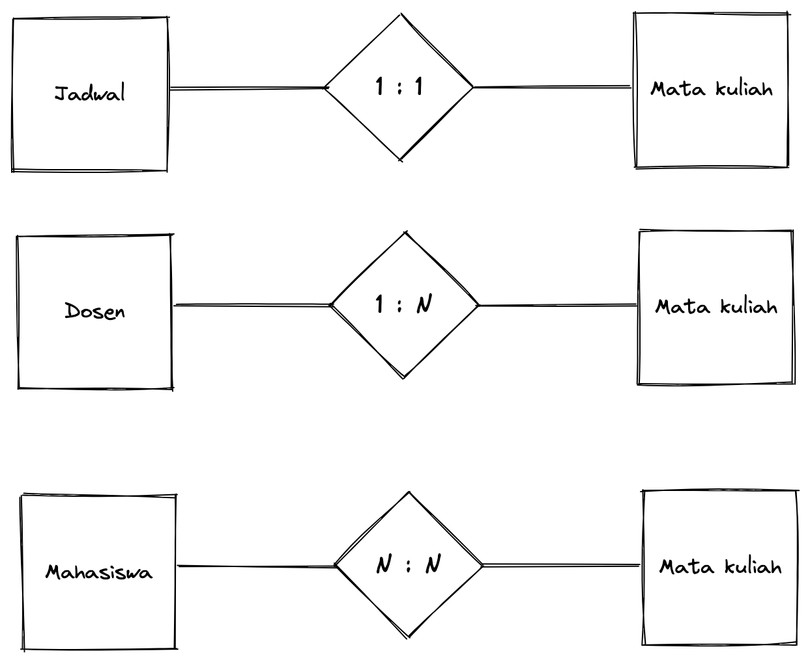

# Database <!-- omit in toc -->

Database merupakan komponen penting dari backend app, yang digunakan untuk menyimpan data. Menyimpan data dan mengakses data yang berjumlah kecil mungkin cukup dengan hanya menyimpan ke text file. Namun jika data yang disimpan sudah kompleks dan memiliki banyak relasi maka dibutuhkan lah database. Kita akan belajar mengenai database, SQL dan apa bedanya dengan NoSQL, kemudian kita akan bahas mengenai Entity Relationship.

Outline:
- [Apa itu database](#apa-itu-database)
- [SQL vs NoSQL](#sql-vs-nosql)
- [Kapan menggunakan SQL dan NoSQL?](#kapan-menggunakan-sql-dan-nosql)
- [PostgreSQL](#postgresql)
- [MongoDB](#mongodb)
- [Entitas](#entitas)
- [Entity Relationship Diagram (ERD)](#entity-relationship-diagram-erd)
  - [Kardinalitas](#kardinalitas)
- [Summary](#summary)

## Apa itu database

Database merupakan kumpulan data yang terorganisir dan sistematis sehingga data dapat dengan mudah disimpan, dikelola, diperbarui dan diakses.

Lalu, apa itu Database Management System (DBMS)?

Database Management System merupakan kumpulan perangkat lunak yang digunakan untuk membuat, mengubah, dan menyediakan akses serta menyajikan data yang ada di database. Contoh DBMS ialah MySQL, PostgreSQL, Oracle dan lainnya.

## SQL vs NoSQL

SQL, singkatan dari Structured Query Language merupakan computer language yang digunakan untuk membuat, mengubah, mencari dan menghapus database records. SQL dibuat oleh IBM pada beberapa dekade yang lalu.

Lalu, apa bedanya dengan NoSQL?

NoSQL merupakan database yang menyimpan data dalam format selain tabel relasional yang ada di SQL atau dalam kata lainnya NoSQL menyimpan data dengan format document, key-value, wide-column, and graph. NoSQL tidak memerlukan skema yang tetap seperti SQL.

NoSQL sering disebut sebagai "Not SQL" atau "Not Only SQL". Contoh NoSQL ialah MongoDB, Redis, Neo4j, Cassandra, Hbase.

## Kapan menggunakan SQL dan NoSQL?

Ketika ingin memutuskan menggunakan database apa, biasanya disesuaikan dengan kebutuhan aplikasi yang akan dibangun.

SQL digunakan ketika: 
- Data yang sangat terstruktur
- Membutuhkan ACID (Atomicity, Consistency, Isolation, Durability) pada transaksi database.

NoSQL digunakan ketika:
- Ketika tidak membutuhkan ACID saat transaksi database.
- Data dengan schema yang fleksibel
- Berorientasi dokumen

## PostgreSQL

PostgreSQL merupakan open source object-relational database system yang memiliki reputasi kuat terhadap keandalan, kokoh dan performa.
PostgreSQL sangat stabil yang didukung oleh lebih dari 20 tahun pengembangan di komunitas open-source.

## MongoDB

MongoDB merupakan database dokumen dengan skalabilitas dan fleksibilitas dengan query dan indexing yang sesuai dengan kebutuhan. Database relasional tradisional menggunakan table dan row, alih-alih menggunakan itu, MongoDB menggunakan collection dan dokumen.

## Entitas

Entity atau entitas merupakan sesuatu atau objek yang dapat diindentifikasi dan dibedakan dengan entitas lainnya. Entitas juga sesuatu yang bisa dilacak, ingin menyimpan atau ingin melihat perubahan data misalnya data akademik. Contoh entitas Mahasiswa, Dosen dll. 

Entitas memiliki atribut contohnya mahasiswa memiliki nama, alamat dan jurusan. Entitas biasanya dapat diidentifikasi berdasarkan atribut unik seperti Nomor induk mahasiswa (NIM).

Praktik terbaiknya, menggunakan atribut yang disebut primary key. Primary key merupakan atribut unik di setiap record yang ada di database. Sebuah entitas hanya akan memiliki satu primary key. 

Contohnya mahasiswa memiliki NIM yang dijadikan sebagai primary key untuk mengidentifikasi sebagai mahasiswa.

Primary key memiliki karakteristik yaitu:

- Unik
- Tidak pernah berubah
- Tidak pernah kosong

## Entity Relationship Diagram (ERD)

Relationship atau relasi merupakan hubungan antara beberapa entitas, dapat digambarkan melalui Entity Relationship Diagram (ERD).

### Kardinalitas

Cardinality atau kardinalitas digunakan untuk mendefenisikan relasi antar dua entitas. Kardinalitas menggambarkan banyaknya jumlah maksimum entitas yang dapat berelasi dengan entitas.

3 kardinalitas yang umum digunakan:

- Satu ke Satu (One to one)
- Satu ke Banyak (One to many)
- Banyak ke Banyak (Many to many)
  
Contoh:

Pada contoh diatas:

- Satu jadwal hanya memiliki satu mata kuliah
- Satu dosen bisa memiliki banyak mata kuliah
- Banyak mahasiswa bisa memiliki banyak mata kuliah

## Summary

Kita sudah mengetahui mengenai pengertain database, SQL, NoSQL dan ERD.

- Database merupakan kumpulan data yang terorganisir dan sistematis sehingga data dapat dengan mudah disimpan, dikelola, diperbarui dan diakses.
- SQL, singkatan dari Structured Query Language merupakan computer language yang digunakan untuk membuat, mengubah, mencari dan menghapus database records.
- NoSQL, merupakan database yang menyimpan data dalam format selain tabel relasional yang ada di SQL atau dalam kata lainnya NoSQL menyimpan data dengan format document, key-value, wide-column, and graph.
- Relationship atau relasi merupakan hubungan antara beberapa entitas, dapat digambarkan melalui Entity Relationship Diagram (ERD).
