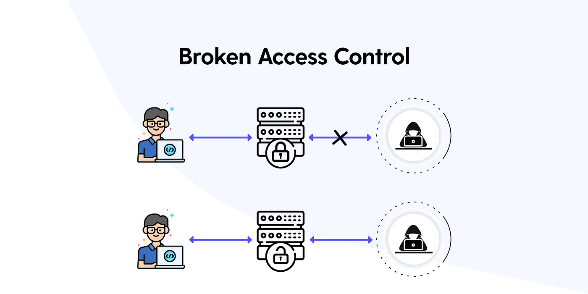

# Web Security Fundamentals <!-- omit in toc -->

Penggunaan teknologi web saat ini semakin pesat, bagi developer sangat penting untuk memahami konsep keamanan web. Keamanan web penting dikuasai karena web rentan terhadap berbagai ancaman dan serangan cyber dalam melindungi data sensitif, reputasi organisasi atau perusahaan, dan keuangan. Dalam pembahasan ini, kita akan belajar apa itu keamanan web, mengapa penting, dan bagaimana mengimplementasikannya untuk melindungi sistem dan aplikasi berbasis web dari serangan dan ancaman yang ada.

Outline:
- [What is web security](#what-is-web-security)
- [Why web security is important?](#why-web-security-is-important)
- [Common web security](#common-web-security)
- [Common attack in web application](#common-attack-in-web-application)
- [Summary](#summary)

## What is web security

Secara umum web security adalah tindakan atau proses pencegahan yang digunakan untuk melindungi website dari serangan dan ancaman keamanan oleh penjahat cyber yang bisa merusak website, mencuri informasi pengguna, atau mencuri akses ke sistem atau data yang disimpan pada server web. 

Keamanan web sangat penting untuk kelangsungan dari setiap bisnis yang menggunakan internet. Jika sebuah website diretas atau peretas mampu memanipulasi sistem atau perangkat lunak, website dan seluruh jaringan dapat dihentikan, dan mengakibatkan operasi bisnis terhenti.

Web security terdiri dari 
- Browser security
- Server-side security
- Cleint-side security

## Why web security is important?

Pada saat ini banyak aplikasi ataupun website yang digunakan untuk kegiatan sehari-hari, seperti e-commerce, banking, and entertainment. Hacker menargetkan aplikasi sebagai sasaran serangan. Sebuah studi baru-baru ini memperkirakan bahwa kejahatan dunia maya akan menelan biaya $5,2 triliun sebagai kerugian di semua industri pada tahun 2024. Studi lain memperkirakan kerugian akan mencapai $6 triliun per tahun sebelum itu. Selain pencurian data dan transaksi keuangan, ancaman aplikasi web dapat menghancurkan aset, niat baik pelanggan, dan reputasi bisnis. Itu membuat keamanan aplikasi web penting untuk perusahaan atau organisasi dari semua ukuran.

Tiga faktor utama yang membuat keamanan aplikasi web begitu penting adalah:

- Mencegah hilangnya data sensitif.
- Menyadari bahwa keamanan melampaui pengujian.
- Melindungi reputasi perusahaan atau organisasi dan membatasi kerugian.

Keamanan web sangat penting untuk melindungi data sensitif pengguna, menjaga kepercayaan dan kredibilitas perusahaan atau organisasi, mencegah serangan siber, mematuhi persyaratan hukum dan regulasi, serta melindungi terhadap malware. Website seringkali mengumpulkan dan menyimpan data sensitif dari pengguna, dan sangat penting untuk melindungi data tersebut untuk mencegah akses tidak sah, pencurian, atau penyalahgunaan. Serangan siber terhadap website dapat merusak reputasi dan kepercayaan sebuah website, menyebabkan hilangnya pelanggan dan kesempatan bisnis. Serangan siber dapat menyebabkan berbagai jenis kerusakan, termasuk pencurian data, perusakan website, dan gangguan pada layanan website. Web security dapat membantu melindungi website dari serangan malware, yang dapat berpotensi membahayakan pengunjung website.

## Common web security 

Banyak teknologi atau metode yang digunakan untuk menerapkan web security, berikut ini merupakan beberapa metode web security yang banyak diterapkan:

1. Web Application Firewalls (WAFs)
   WAF merupakan singkatan dari Web Application Firewall merupakan teknik pengamanan yang dapat membantu melindungi aplikasi web dengan cara memfilter dan memantau lalu lintas HTTP antara aplikasi web dan internet. WAF dapat membantu mendeteksi dan mencegah aktivitas berbahaya seperti cross-site forgery, cross-site-scripting (XSS), file inclusion, dan SQL injection. WAF adalah protokol pertahanan lapisan 7 (dalam model OSI).

   

   WAF bekerja dengan menganalisis lalu lintas HTTP dan HTTPS untuk mengidentifikasi dan memblokir ancaman seperti injeksi SQL, skrip lintas situs (XSS), dan jenis serangan lain yang mengeksploitasi kerentanan dalam aplikasi web. Ini dilakukan dengan menerapkan seperangkat aturan atau kebijakan yang disebut policies yang dirancang untuk mendeteksi dan memblokir pola serangan yang diketahui. Salah satu manfaat utama WAF adalah kemampuannya menyediakan lapisan pertahanan tambahan untuk aplikasi web. Bahkan jika aplikasi web memiliki kerentanan yang dapat dieksploitasi oleh penyerang, WAF dapat membantu mencegah kerentanan tersebut dieksploitasi dengan memblokir lalu lintas berbahaya sebelum mencapai aplikasi.

   WAF menganalisis permintaan Hypertext Transfer Protocol (HTTP) dan menerapkan seperangkat aturan yang menentukan bagian mana dari percakapan tersebut yang tidak berbahaya dan bagian mana yang berbahaya. Bagian utama yang dianalisis WAF adalah HTTP GET dan POST. HTTP GET digunakan untuk mengambil data dari server, dan HTTP POST digunakan untuk mengirim data ke server.

2. Vulnerability Scanners
   Vulnerabilities (kerentanan) merupakan kelemahan yang terjadi pada saat pengkodean sebuah perangkat lunak atau kesalahan dalam konfigurasi sistem yang menyebabkan attackers dapat akses secara langsung ke sistem atau jaringan secara tidak sah.
   
   Vulnerability scanner (pemeriksaan kerentanan) merupakan pemindaian titik potensial yang menjadi celah keamanan. Vulnerability scanners mendeteksi dan mengklasifikasikan kelemahan sistem di komputer, jaringan, dan peralatan komunikasi serta memprediksi keefektifan penanggulangan kerentanan.

   Vulnerability scanner dapat digunakan untuk pemindaian jaringan internal dan eksternal. Pemindaian internal dilakukan dari dalam jaringan untuk mengidentifikasi kerentanan yang dapat dieksploitasi oleh penyerang yang telah memperoleh akses ke jaringan. Sedangkan pemindaian eksternal dilakukan dari luar jaringan untuk mengidentifikasi kerentanan yang dapat dieksploitasi oleh penyerang yang mencoba mendapatkan akses tidak sah ke jaringan.

   Web vulnerability scanner merupakan pemindaian kode aplikasi/situs web untuk menemukan kerentanan yang membahayakan aplikasi/situs web itu sendiri atau layanan back-endnya.

3. Password-cracking
   Password cracking adalah proses untuk meretas kata sandi yang tidak diketahui atau yang sudah hilang (lupa). Ketika kehilangan password ke sebuah sistem kita juga kehilangan akses ke sistem tersebut, dengan menggunakan password cracking tool dapat mengembalikan password yang telah hilang atau lupa sehingga memiliki akses kembali ke sistem tersebut. Teknik ini juga dapat digunakan untuk pemulihan ketika seseorang melakukan penetrasi ke sistem dan mengganti password yang ada di sistem. Selain itu,
   password cracking juga dapat digunakan untuk melakukan testing terhadap password dari user yang ada di sistem apakah user menggunakan password yang kuat atau lemah, atau password yang sesuai dengan aturan yang kita buat

4. Fuzzing test
   Fuzzing test adalah pengujian black box yang terdiri dari menemukan bug pada implementasi coding dan memberitahukan masalah potensial yang akan terjadi untuk membantu developer memperbaiki masalah tersebut dengan memasukan input invalid, malformed, or unexpected inputs.
   
5. Black box testing
   Black box testing adalah teknik pengujian yang hanya berfokus kepada input dan output dari sebuah software tanpa mengetahui bagaimana sebuah software itu bekerja dibelakangnya. Penguji akan memberikan input, dan mengamati output yang dihasilkan oleh sistem yang diuji. Black box testing sangat cocok digunakan untuk mencari celah dari sebuah software karena pengujian ini akan menguji software secara menyeluruh (end-to-end). Black box testing dapat dilakukan oleh siapa saja karena tidak membutuhkan kemampuan teknis yang mendalam.

6. White box testing
   White box testing adalah teknik pengujian terhadap internal structure, design, and coding untuk memastikan kelancaran flow data masuk dan keluar dari software yang dibangun. Kalo black box testing dari sudut pandang pengguna maka white box testing dari sudut pandang developer. White box testing dilakukan oleh orang yang bisa memahami coding.
   
   
## Common attack in web application

Menurut komunitas open source yang bergerak di bidang keamanan software, OWASP (Open Worldwide Application Security Project) ada 10 jenis resiko keamanan web yang sering terjadi, yaitu:

1. Injection
   Injection sering terjadi pada sebuah aplikasi saat ini, yang disebabkan oleh input dari pengguna yang diartikan sebagai perintah atau parameter oleh aplikasi. Contohnya SQL Injection dan Command Injection. Modify dan Delete dalam database. Untuk mencegah serangan injection, penting untuk memastikan bahwa input yang dikirim pengguna tidak diartikan sebagai kueri atau perintah. Langkah yang dapat dilakukan untuk mencegahnya, yaitu:
   1. Menggunakan allow-list: saat mengirim input dari user ke server dengan cara membandingkan input yang dikirim dengan daftar input yang aman dan diizinkan. Jika input aman, maka proses dilanjutkan dan ketika input dianggap berbahaya maka akan ditolak untuk diproses dan akan menampilkan pesan error.
   2. Validasi input: ketika input yang dikirim tidak berhasil melewati tahap validasi maka input ini tidak akan dikirim dan diproses.

2. Broken authentication
   Dalam aplikasi web modern, authentication and session management sangatlah penting. Authentication memungkinkan pengguna untuk masuk ke aplikasi web dengan cara memverifikasi identitas pengguna. Biasanya, pengguna akan memasukkan nama pengguna dan kata sandi untuk melakukan verifikasi oleh server, server akan memeriksa apakah identitas mereka cocok dengan yang ada di server. Jika benar, server akan memberikan session cookie ke browser pengguna. Session cookie ini penting karena memungkinkan server untuk melacak aktivitas pengguna, sementara server dan browser berkomunikasi melalui HTTP(S) yang tidak memiliki ingatan (stateless). Dengan adanya session cookie server akan mengetahui siapa yang mengirim data apa dan server dapat memantau tindakan yang dilakukan pengguna dan menjaga keamanan aplikasi web.
   Langkah yang dapat dilakukan untuk mencegah resiko ini, yaitu:
   1. Multi-factor authentication: ketika pengguna melakukan login menggunakan nama dan kata sandi, kirim juga kode ke mobile device atau email pengguna sehingga orang yang melakukan serangan akan kesulitan untuk mencuri akses pengguna.
   2. Hindari penggunaaan password default: hindari menggunakan kata sandi default oleh admin yang ada di sistem, biasanya password default gampang ditebak oleh penyusup.
   3. Check password lemah: ketika pengguna melakukan registrasi, lakukan pengecekan terhadap kata sandi pengguna jika kata sandi lemah dan gampang ditebak maka beritahu pengguna agar menggunakan kata sandi yang sulit untuk ditebak.
   4. Limit attempt login: ketika pengguna gagal login ke sistem, batasi kesempatan login dan berikan delay waktu login misalnya 3 kali kesempatan dalam satu jam.

3. Sensitive data exposure
   Aplikasi web sering mengekspos data sensitif pengguna secara tidak sengaja yang dapat disalahgunakan untuk tujuan kejahatan siber seperti pencurian identitas, penipuan keuangan dan lainnya yang dapat merugikan pengguna. Data sensitif dapat berupa identitas pribadi (nama, tanggal lahir, alamat), informasi keuangan (nomor rekening), dan medical record. Data yang ada di aplikasi web harus dilindungi pada saat proses pengiriman ke server, pada saat transit, pada saat rest (di db atau storage) terutama untuk mematuhi peraturan perlindungan data pribadi seperti EU's General Data Protection Regulation (GDPR). Langkah yang dapat dilakukan untuk mencegah resiko ini, yaitu:
   1. Enkripsi data: data sensitif milik pengguna haruslah dienkripsi pada saat pengiriman data atau pada on rest sehingga ketika terjadi serangan siber, data yang curi setidaknya tidak bisa dibaca.
   2. Enkripsi data in transit: enkripsikan semua data saat transit dengan protokol aman seperti TLS dengan penyandian perfect forward secrecy (PFS), prioritas penyandian oleh server, dan parameter aman. Terapkan enkripsi menggunakan HTTP Strict Transport Security (HSTS).
   3. Klasifikasikan data: data yang ada diklasifikasikan berdasarkan data sensitif, data untuk kebutuhan bisnis, data yang menjadi persyaratan peraturan. Dan hindari pengumpulan data sensitif yang tidak diperlukan.

4. XML external entities (XXE)
   Serangan XML External Entity (XXE) adalah kerentanan yang memanfaatkan fitur parser/data XML yang memungkinkan penyerang untuk berinteraksi dengan backend atau sistem eksternal apa pun yang dapat diakses oleh aplikasi itu sendiri dan memungkinkan penyerang untuk membaca file di sistem kita. Serangan ini juga dapat menyebabkan serangan Denial of Service (DoS) atau dapat menggunakan XXE untuk melakukan Server-Side Request Forgery (SSRF) yang mendorong aplikasi web untuk membuat permintaan ke aplikasi lain. XXE bahkan dapat scanning port dan menyebabkan sistem bisa dikendalikan jarak jauh.
   Ada dua jenis serangan XXE:
   1. Serangan XXE in-band adalah serangan di mana penyerang dapat menerima respons langsung terhadap muatan XXE.
   2. Serangan XXE out-of-band (juga disebut blind XXE), tidak ada tanggapan langsung dari aplikasi web dan penyerang harus merefleksikan keluaran muatan XXE mereka ke beberapa file lain atau server mereka sendiri.
   
   Langkah yang dapat dilakukan untuk pencegahan, yaitu:
   3. Hindari penggunaan format data kompleks: gunakan format data sederhana seperti JSON.
   4. Upgrade library XML: semua library yang digunakan oleh aplikasi atau pada sistem operasi yang mengolah XML
   5. Validasi server-side input: Terapkan validasi dan pemfilteran terhadap input di sisi server untuk mencegah data yang berbahaya dalam dokumen XML, header, atau node.

5. Broken access control
   
   Broken access control merupakan kerentanan yang mengizinkan pengguna yang tidak sah untuk mengakses ke sebuah resources yang dibatasi. Misalnya halaman admin hanya bisa diakses oleh pengguna yang memiliki role sebagai admin, ketika pengguna biasa dapat mengakses halaman admin artinya telah terjadi broken access control. Broken access control menyebabkan dapat diaksesnya data sensitif yang dapat digunakan untuk tujuan penipuan, data breach sehinga merugikan pihak perusahaan atau organisasi. Langkah yang dapat dilakukan untuk pencegahan, yaitu:
   1. Menerapkan role based access controls: merupakan kontrol akses berbasis role misalnya semakin tinggi role maka semakin banyak akses yang diberikan.
   2. Log access controls: berikan log ketika terjadi failure dan terhadap aktifitas yang dilakukan serta memberikan notifikasi ketika terjadi failure yang berulang.
   3. Menggunakan token dan validasi: salah satu token yang dapat digunakan adalah JWT Token, ketika user logout maka token tersebut akan menjadi invalid sehingga ketika ada yang menggunaka token tersebut akan ditolak server.  

6. Security misconfiguration
   Security misconfiguration terjadi ketika pengaturan keamanan tidak dibuat/didefenisikan secara benar dalam proses konfigurasi atau menggunakan pengaturan default. Kerentanan ini terjadi ketika salah satu dari penyebab ini terjadi seperti akun dan kata sandi default masih digunakan, tidak ada penguatan sistem atau konfigurasi yang dilakukan tidak benar, dan menginstall fitur yang tidak diperlukan. Langkah yang dapat dilakukan untuk pencegahan, yaitu:
   1. Lakukan otomisasi konfigurasi: konfigurasi dan verifikasi di semua lingkungan dilakukan secara otomatis.
   2. Review dan update konfigurasi: lakukan proses review dan pengupdate-an konfigurasi sesuai dengan catatan keamanan, pembaruan dan patch keamanan.
   3. Hapus fitur yang tidak diperlukan: hapus fitur atau komponen yang tidak digunakan sehingga hanya ada minimal fitur atau komponen yang digunakan.

7. Cross-site scripting (XSS)
   XSS adalah kerentanan keamanan yang biasanya ditemukan di aplikasi web, XSS merupakan jenis injeksi yang memungkinkan penyerang mengeksekusi skrip jahat dan menjalankannya di sistem korban. Sebagian besar keretanan XSS menyuntikkan script yang menyebabkan browser mengeksekusi beberapa JavaScript yang dibuat oleh penyerang. Ada 3 jenis XSS: Reflected XSS, Stored XSS, DOM XSS. 
   
   Langkah yang dapat dilakukan untuk pencegahan, yaitu:
   1. Content security polici: Content Security Policy (CSP) dapat digunakan untuk mengurangi keparahan kerentanan XSS yang terjadi.
   2. Filter input on arrival: pada saat di mana input pengguna diterima, filter seketat mungkin berdasarkan input yang diharapkan atau input yang valid.
   3. Encode data on output: enkode output dari response HTTP yang diterima untuk mencegah ditafsirkan nya sebagai konten aktif.
   4. Menggunakan response headers: kita dapat menggunakan header Content-Type dan X-Content-Type-Options untuk memastikan bahwa browser menginterpretasikan respons sesuai dengan keinginan.

8. Insecure deserialization
   Insecure deserialization adalah kerentanan di mana data yang tidak dipercaya atau tidak dikenal digunakan untuk menimbulkan serangan denial of service (serangan DoS), mengeksekusi kode, melewati autentikasi, atau lebih lanjut menyalahgunakan logika di balik aplikasi. Serialization adalah proses mengubah objek menjadi format yang nantinya dapat dipulihkan. Deserialization adalah proses yang mengambil data dari sebuah file, stream atau network dan dibangun kembali menjadi objek. Penyerang akan memanfaatkan proses deserialization ini untuk menjadi titik masuk ke sistem. Langkah yang dapat dilakukan untuk pencegahan, yaitu:
   1. Menerapakan pemeriksaan identitas: cek tanda tangan digital pada objek serialization untuk mencegah pengrusakan.
   2. Monitoring proses deserialization.
   3. Enkripsi proses serialization.

9. Components with Known Vulnerabilities
   Komponen library atau framework yang digunakan pada sistem atau aplikasi memiliki hak istimewa yang sama dengan aplikasi tersebut, jika komponen dieksploitasi maka penyerang dapat dengan mudah masuk ke sistem dan mengakibatkan pencurian data atau pengambilalihan server. Sebuah sistem dapat mengalami kerentanan ini apabila komponen yang digunakan sudah kadaluarsa, tidak mengetahui versi dari komponen, tidak melakukan pembaruan terhadap komponen yang digunakan dan lain sebagainya. Langkah yang dapat dilakukan untuk pencegahan, yaitu:
   1. Menghapus komponen, library, framework, dan fitur dari komponen yang tidak digunakan.
   2. Catat dan monitor versi komponen yang digunakan dan lakukan pembaruan versi (up to date).
   3. Mnggunakan komponen yang berasal dari sumber resmi.
    
10. Insufficient Logging & Monitoring
   Logging dan monitoring yang tidak memadai merupakan celah yang bisa dimanfaatkan penyerang untuk masuk ke dalam sistem tanpa terdeteksi. Upaya masuk dan perilaku yang mencurigakan sulit dideteksi ketika logging dan monitoring tidak dibuat dengan baik, dan secara signifikan meningkatkan kemungkinan penyerang berhasil mengeksploitasi sistem kita. Kerentanan ini terjadi apabila aktifitas seperti login, login gagal, transaksi, dan error tidak dilakukan pencatatan dan monitoring. Langkah yang dapat dilakukan untuk pencegahan, yaitu:
   1. Logging dan monitoring aktifitas: aktifitas seperti login dan transaksi harus dilakukan logging.
   2. Membuat logging yang mudah dibaca dan dipahami.
   3. Automasi monitoring and alerting: log events yang ada disistem dibuat secara otomatis.

## Summary

Web security merupakan hal yang sangat penting dan harus diperhatikan dengan serius untuk menjaga keamanan dan keberlangsungan operasi di perusahaan atau organisasi. Penting untuk memahami risiko yang mungkin terjadi dan mengambil langkah-langkah yang diperlukan untuk meminimalkan kemungkinan terjadinya serangan. Kita telah belajar pengertian web security, kenapa pentingnya keamanan web, serangan yang sering terjadi di web dan pengamanan web secara umum. Semoga dengan memahami web security ini, diharapkan dapat menerapkannya sehingga website dapat terus beroperasi dengan aman dan memberikan pengalaman yang terbaik bagi pengguna.
