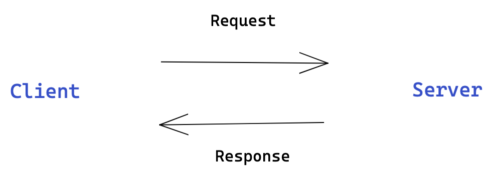

# Web Development Fundamentals <!-- omit in toc -->

Pada materi ini kita akan membahas tentang fundamental dalam web development yang ditujukan untuk seseorang yang ingin menjadi web developer baik itu front-end maupun back-end. Kita perlu memahami fundamental dari web development itu sendiri untuk memudahkan kita dalam proses belajar maupun melakukan pengembangan sebuah website.

Outline:

- [Cara kerja website](#cara-kerja-website)
- [Jenis pengembangan pada web development](#jenis-pengembangan-pada-web-development)
- [Tools yang digunakan untuk web development](#tools-yang-digunakan-untuk-web-development)
- [Summary](#summary)

## Cara kerja website

Website merupakan kumpulan dari web page yang menampilkan teks atau gambar yang berisikan informasi dan bisa diakses melalui jaringan internet, website biasanya disebut juga sebagai "web site" atau "site".

Dengan menggunakan browser dan koneksi internet, kita sudah bisa untuk mengakses website, tapi tahukah kamu bagaimana cara kerja website?

- Client  
    > Client merupakan komputer yang digunakan untuk mengakses suatu layanan disebut dengan client, misalnya sebuah komputer yang digunakan untuk mengakses youtube.

- Server
    > Server merupakan komputer yang menyimpan web pages atau penyedia layanan untuk diakses oleh client, atau disebut juga dengan web server.  

Apa yang terjadi ketika kita mengakses sebuah website?

1. Ketika mengetik suatu alamat website di browser, browser akan menghubungi DNS Server untuk menemukan alamat dari situs web yang dituju.

2. Browser mengirimkan pesan permintaan (request) HTTP ke server melalui koneksi internet dan protocol TCP/IP, untuk menampilkan situs web yang diminta client.

3. Server akan merespon permintaan klien, memberikan respon sesuai yang diminta dan server mengirimkan pesan "200 OK" kepada client jika permintaan client itu tersedia dan akan merespon dengan "404 - not found" ketika permintaan client tidak tersedia. Dan kemudian mulai menampilkan situs web ke browser.

## Jenis pengembangan pada web development

Dalam web development terdapat beberapa jenis pengembangan seperti client-side dan server-side.

Client-side merupakan pengembangan di sisi client untuk ditampilkan ke pengguna menggunakan HTML, CSS atau JavaScript.

Server-side merupakan pengembangan di sisi server seperti pengolahan data, dan penyimpanan data. Di server ini lah dilakukan pemrosesan sesuai permintaan dari client/user.

Selain itu, ada kategori role dalam pengembangan website, apa saja itu? Dan apa bedanya?

- Front-end merupakan role yang bertanggung jawab untuk membuat halaman yang dilihat oleh user dan berinteraksi langsung dengan user. Front-end lah yang membuat tombol, teks, atau link yang bisa user lihat dan berinteraksi.
  
- Back-end merupakan role yang bertanggung jawab untuk membuat web berfungsi dengan baik di sisi server atau server-side dan tidak dapat dilihat oleh client/user. Back-end yang membuat fungsi untuk menyimpan data, menampilkan data dari database.

- Full stack merupakan role yang bertanggung jawab untuk front-end dan back-end.

  

## Tools yang digunakan untuk web development

Beberapa tools umum yang digunakan adalah:

1. IDE
    > IDE merupakan singkatan dari Integrated Development Environment merupakan tools yang mempermudah dalam menulis code dan membangun aplikasi. IDE dilengkapi dengan code editor dan debugger. IDE yang paling populer digunakan untuk web development adalah Visual Studio Code (VS Code), VS Code gampang digunakan dan juga gratis. Untuk membaca dokumentasi resminya: [VS Code](https://code.visualstudio.com/)

2. Git/Github

    >  - Git merupakan version control system yang digunakan untuk menyimpan source code, memanajemen perubahan pada source code.
    >  - Github merupakan tools untuk menyimpan projek git di remote server sehingga memudahkan berkolaborasi dengan team dan tidak perlu menggunakan flash disk atau hard disk ketika ingin menyalin atau mengirim source code.

## Summary

1. **Website** merupakan kumpulan dari web page yang menampilkan teks atau gambar yang berisikan informasi dan bisa diakses melalui jaringan internet, website biasanya disebut juga sebagai "web site" atau "site".

2. **Front-end** merupakan role yang bertanggung jawab untuk membuat halaman yang dilihat oleh user dan berinteraksi langsung dengan user. Front-end lah yang membuat tombol, teks, atau link yang bisa user lihat dan berinteraksi.
  
3. **Back-end** merupakan role yang bertanggung jawab untuk membuat web berfungsi dengan baik di sisi server atau server-side dan tidak dapat dilihat oleh client/user. Back-end yang membuat fungsi untuk menyimpan data, menampilkan data dari database.

4. **Full stack** merupakan role yang bertanggung jawab untuk front-end dan back-end

5. **Tools yang digunakan** untuk web development yaitu VS Code dan Git/Github.
